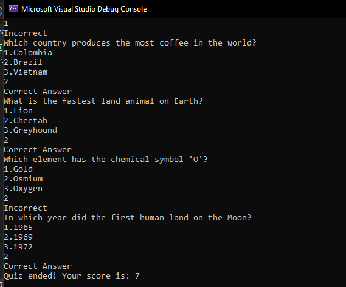

# Console Quiz App

A lightweight, interactive C# console application that dynamically loads multiple-choice trivia questions from a text file, evaluates user answers in real time, and tracks the final score.

## Screenshot



## Features

- **Dynamic File Loading:** Reads questions and multiple-choice options directly from an external `questions.txt` file.
- **Smart Parsing:** Automatically identifies the correct answer using a `>` character flag while hiding the symbol from the player during gameplay.
- **Instant Feedback:** Tells the player immediately whether their selected option was correct or incorrect.
- **Score Tracking:** Calculates and displays the final score at the end of the quiz session.

## How It Works

The application reads `questions.txt` sequentially. Every 4 lines represent a single quiz block:

1. **Line 1:** The Trivia Question
2. **Lines 2–4:** Three multiple-choice options (the correct answer is prefixed with `>`).

## Getting Started

### Prerequisites

- [.NET SDK](https://dotnet.microsoft.com/download) installed on your machine.

### Installation & Running

1. Clone this repository:
   ```bash
   git clone [https://github.com/Alyasa62/Console-Quiz-app-in-C-Sharp-.git](https://github.com/Alyasa62/Console-Quiz-app-in-C-Sharp-.git)
   ```
